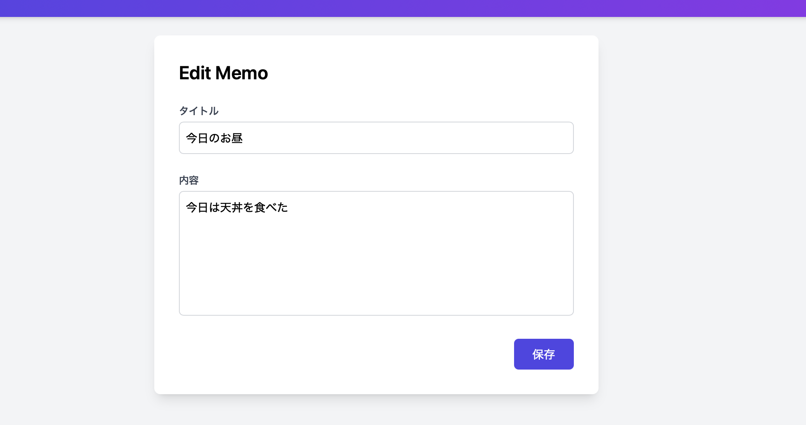
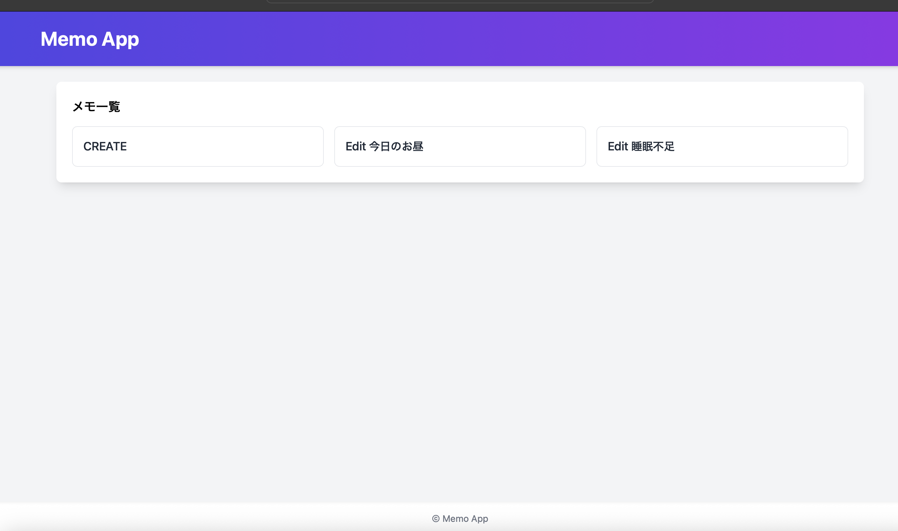

# Memo App

Flask と **Tailwind CSS** を使用した、モダンでスタイリッシュなメモアプリケーションです。

---

## 📸 デモスクリーンショット

 
  
 

---

## 🚀 目次

- [✨ 特徴](#-特徴)  
- [📦 技術スタック](#-技術スタック)  
- [⚙️ インストール・起動方法](#️-インストール・起動方法)  
- [🗂 プロジェクト構成](#-プロジェクト構成)  
  

---

## ✨ 特徴

- **グラデーションヘッダー** と **レスポンシブグリッド** を活用した一覧画面  
- **フォーカスリング** や **ホバーエフェクト** でインタラクティブな入力フォーム  
- SQLite をバックエンドに使ったシンプル CRUD  
- 単一ファイルで動作する軽量設計  

---

## 📦 技術スタック

| レイヤー     | 技術・ライブラリ           |
| ------------ | -------------------------- |
| Backend      | Python 3.x, Flask         |
| Database     | SQLite                    |
| Frontend     | Tailwind CSS (CDN)        |
| Templating   | Jinja2                    |

---

## ⚙️ インストール・起動方法

1. **リポジトリをクローン**  
   ```bash
   git clone https://github.com/kanzoujapan/memo_app.git
   cd memo_app

## 🗂 プロジェクト構成

- `memo_app/`
  - `memo_edit_app.py`  
    アプリ本体（Flask エントリポイント）
  - `templates/`  
    ├─ `base.html` — ベースレイアウト  
    ├─ `list.html` — メモ一覧画面  
    └─ `memo.html` — メモ編集画面  
  - `instance/`  
    └─ `memo_edit.sqlite` — SQLite データベース  
  - `README.md`  
    このファイル
